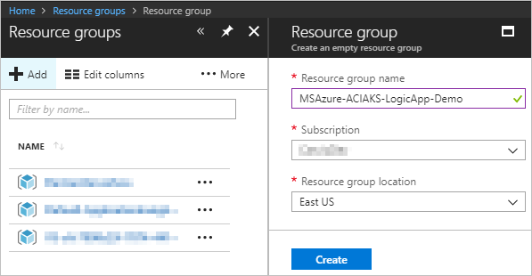
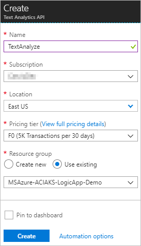
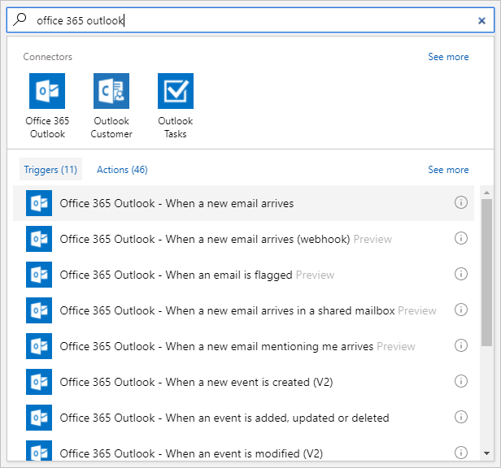
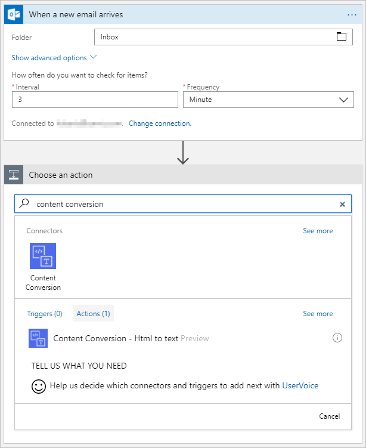

# Create container-based serverless workflows with Azure Logic Apps and Azure Container Instances

Azure Logic Apps enables the creation of powerful business workflows by integrating *connectors* for various services into a single graphical interface. With the connector for Azure Container Instances, you can run containerized applications as part of your Logic Apps workflow. This article covers how to create a simple workflow using the Azure Container Instances connector.
 
In this article, you create a logic app that regularly checks Email and Twitter for new items. If new items exist, the logic app runs a container in Azure Container Instances that analyze the sentiment of that text. When you're done, your logic app looks like this workflow at a high level:


To follow this quickstart, you need an email account from a provider that's supported by Logic Apps, such as Office 365 Outlook, Outlook.com, or Gmail. For other providers, [review the connectors list here](https://docs.microsoft.com/connectors/). This logic app uses an Office 365 Outlook account. If you use another email account, the overall steps are the same, but your UI might slightly differ. 

Also, if you don't have an Azure subscription, 
<a href="https://azure.microsoft.com/free/" target="_blank">sign up for a free Azure account</a>.

And you need a Twitter account to get tweets.

## Build Docker images

Build the Docker images required for the containers on your local machine.

1. Clone this repository to your local machine.

    ```powershell
    git clone https://github.com/Azure-Samples/aci-logicapps-integration.git
    cd aci-logicapps-integration
    ```

2. Execute the command below to build and push the **sentiment** image to Docker Hub.

   ```powershell
   docker build -t YOURDOCKERACCOUNTNAME/sentiment .
   docker push YOURDOCKERACCOUNTNAME/sentiment
   ```

## Sign in to the Azure portal

Sign in to the <a href="https://portal.azure.com" target="_blank">Azure portal</a> with your Azure account credentials.

## Create a resource group

1. From the main Azure menu, choose **Resource groups** > **+ Add**

2. Input the name of the resource group e.g. `MSAzure-ACI-AKS-LogicApp-Demo`, then click **Create**.

    

## Create your Text Analyze service

1. Open the resource group you just created, choose **+ Add** on the nav bar.

3. Input `Text Analytics API` in search box, then choose the **Text Analytics API** > **Create** in results.

    

4. Under **Create Text Analytics API**, provide details about your Text Analytics API as shown here. After you're done, choose **Create**.

    

   | Setting | Value | Description | 
   | ------- | ----- | ----------- | 
   | **Name** | TextAnalyze | The name for your Text Analytics API | 
   | **Subscription** | <*your-Azure-subscription-name*> | The name for your Azure subscription | 
   | **Location** | East US | The region where to store your logic app information | 
   | **Price tier** | F0 | In this case, we will use the free version of this service. | 
   | **Resource group** | MSAzure-ACI-AKS-LogicApp-Demo | The name for the [Azure resource group](../azure-resource-manager/resource-group-overview.md) used to organize related resources |

5. Navigate to the Text Analytics API you just created, copy the **Endpoint**. This will be used in logic app creation.

    

5. Then click **Show access keys** under **Manage keys**, and copy the **Key**. This will be used in logic app creation.

    


## Create your logic app 

1. Open the resource group you just created, choose **+ Add** on the nav bar.
    

3. Input `logic app` in search box, then choose the **Logic App** > **Create** in results.

    

3. Under **Create logic app**, provide details about your logic app as shown here. After you're done, choose **Pin to dashboard** > **Create**.

    

   | Setting | Value | Description | 
   | ------- | ----- | ----------- | 
   | **Name** | EmailAnalyze | The name for your logic app | 
   | **Subscription** | <*your-Azure-subscription-name*> | The name for your Azure subscription | 
   | **Resource group** | MSAzure-ACI-AKS-LogicApp-Demo | The name for the [Azure resource group](../azure-resource-manager/resource-group-overview.md) used to organize related resources | 
   | **Location** | East US | The region where to store your logic app information | 
   | **Log Analytics** | Off | Keep the **Off** setting for diagnostic logging. | 

3. After Azure deploys your app, the Logic Apps Designer opens and shows a page with an introduction video and commonly used triggers. Under **Templates**, 
choose **Blank Logic App**.

    

Next, add a trigger that fires when a new Email arrives. Every logic app must start with a trigger, which fires when a specific event happens or when a specific condition is met. Each time the trigger fires, the Logic Apps engine creates a logic app instance that starts and runs your workflow.

## Check Email with a trigger

1. On the designer, enter `office 365 outlook` in the search box. Select this trigger: **Office 365 Outlook - When a new email arrives**.

   

2. Login with your Office 365 account, provide this information for your trigger as shown and described: 

   

   | Setting | Value | Description | 
   | ------- | ----- | ----------- | 
   | **Folder** | Inbox | The folder of your Outlook you want to monitor | 
   | **Interval** | 3 | The number of intervals to wait between checks | 
   | **Frequency** | Minute | The unit of time for each interval between checks  | 

   Together, the interval and frequency define the schedule for your logic app's trigger. This logic app checks the feed every 3 minutes.

3. Save your logic app. On the designer toolbar, choose **Save**. 

Your logic app is now live but doesn't do anything other than check the Email. So, add an action that responds when the trigger fires.

## Run a container to get the sentiment

Now add an action to create an Azure Container Instances that analyze the sentiment of this email.

1. Under the **When a new email arrives** trigger, choose **+ New step** > **Add an action**.

   

2. Under **Choose an action**, search for "content conversion", then select the **Content Conversion - Html to text** action. 

   

3. In the **Content** textbox, choose the **Body** of the email as an input.

   

2. Under **Choose an action**, search for `container`, then select the **Azure Container Instance - Create container group** action.

   

3. Choose a subscription, resource group, deployment location, and name for your container group.

4. In this case, the container group contains just one container. Choose a name for the container, then specify the following values:

   - Image: `hubertsui/sentiment`
   - CPU request: 1.0
   - Memory request 1.5

7. Create 3 container environment variables, then fill it with following values:

   | Setting | Description | 
   | ------- | ----------- | 
   | **BASE_URL** | The **Endpoint** of Text Analytics API. Remember to add a `/` after the url if there is not. | 
   | **SUBSCRIPTION_KEY** | The **Key** of Text Analytics API. | 
   | **TEXT** | The text to get sentiment.  | 

8. Finally, set the **RestartPolicy** property to *OnFailure*. This ensures that your container will not restart if it exits successfully.

   When you are done, the *Create container group* step will look something like this:

   

## Add a delay to let the container run

For simplicity, the logic app pulls the summarized text from the container logs. To ensure that the container has time to run, add delay logic to the app.

1. Click **+ New step** > **More** > **Add a do until**, then click **+ Add an action** inside of the Until

2. Under **Choose an action**, search for `container`, then select the **Azure Container Instance - Get properties of a container group** action. 

   

3. Choose a subscription, resource group, deployment location, and name for your container group.

   

4. Set the condition of the **Until** to this: **state** is equal to `Succeeded`. The state is **the state of the group**.

   

5. Click **Add a condition**, then set the condition as same as the condition of the Unti.

   

6. In false part, click **Add an action**, search for `Delay`, then select the **Schedule - Delay** action.

   

2. Choose the **Schedule - Delay** action and configure a 10 second delay.

## Collect the container logs

Now add a new action to collect the logs from the completed container, which contain the summarized text of the article.

1. Click **Add an action** again in true part of the condition and search for `container`.

2. Choose the **Azure Container Instances - Get logs of a container** action.

3. Fill in the subscription, resource group, container group name, and container name from previous steps.

## Delete the container group

Now we need to clean up the created resource group.

Now add a new action to collect the logs from the completed container, which contain the summarized text of the article.

1. Click **Add an action** again in true part of the condition and search for `container`.

2. Choose the **Azure Container Instances - Delete container group** action.

3. Fill in the subscription, resource group, container group name, and container name from previous steps.

## Run your logic app

Send an email to your Outlook, and wait for 3 minutes.

Now you can see the flow has running history.

Click a running history, and navigate to **Get logs of a container** action.

Now you can see the sentiment of your email.


## Create Logic App to analyze Tweets

1. Navigate to the Logic App you just created, then click the **Overview** > **Clone**.

2. Input the name of new Logic App as `TwitterAnalyze`, then choose **Create**.
    
   

3. Navigate to the `TwitterAnalyze` app, choose **Logic App Designer**.

4. In **Create container group** action, remove all dynamic contents from it so we can delete previous actions.

   | Name | Description | 
   | ------- | ----------- | 
   | **Message Id** | The message id of your email. | 
   | **The plain text content** | The plain text content of your email. |

5. Delete **Html to text** and **When a new email arrives**.

6. Search for "twitter" then choose the **Twitter - When a new tweet is posted**.

   

7. Login with your Twitter account, provide this information for your trigger as shown and described: 

   

   | Setting | Value | Description | 
   | ------- | ----- | ----------- | 
   | **Search text** | from:USER_NAME | This will fetch new tweets from a twitter user. | 
   | **Interval** | 3 | The number of intervals to wait between checks | 
   | **Frequency** | Minute | The unit of time for each interval between checks  | 

8. Then set the **Create container group** action like this.

   


## Clean up resources

When no longer needed, delete the resource group that contains your logic app and related resources. 
On the main Azure menu, go to **Resource groups**, and select the resource group for your logic app. 
Choose **Delete resource group**. Enter the resource group name as confirmation, and choose **Delete**.

## Run your logic app for Twitter

Send a tweet with selected account in Twitter, and wait for 3 minutes.

Now you can see the flow has running history.

Click a running history, and navigate to **Get logs of a container** action.

Now you can see the sentiment of your tweet.


